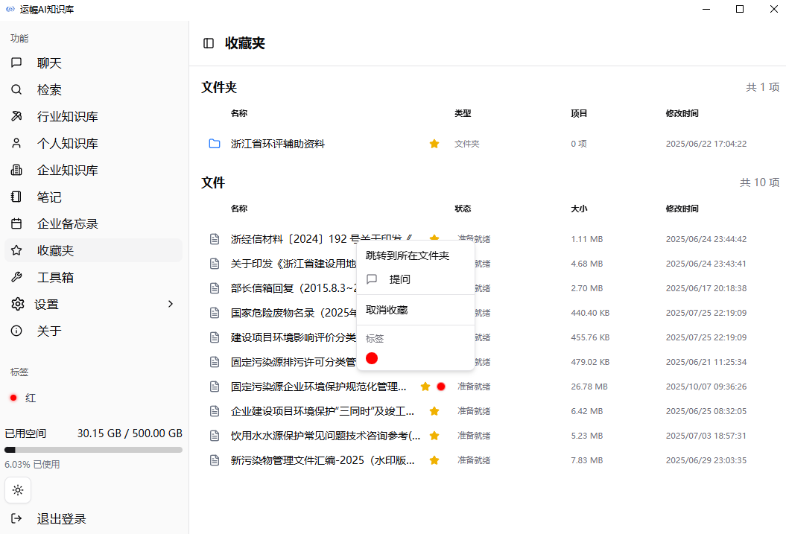
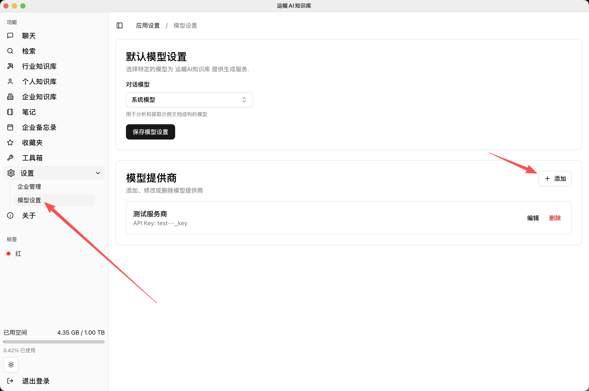
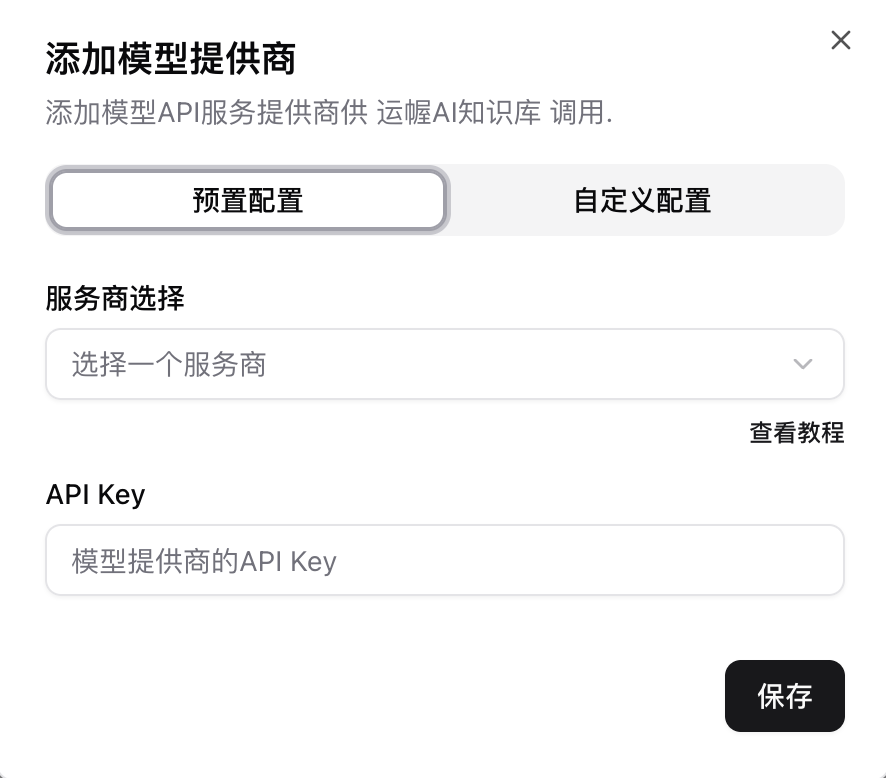
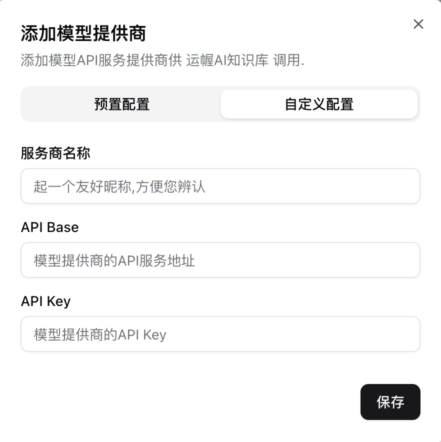
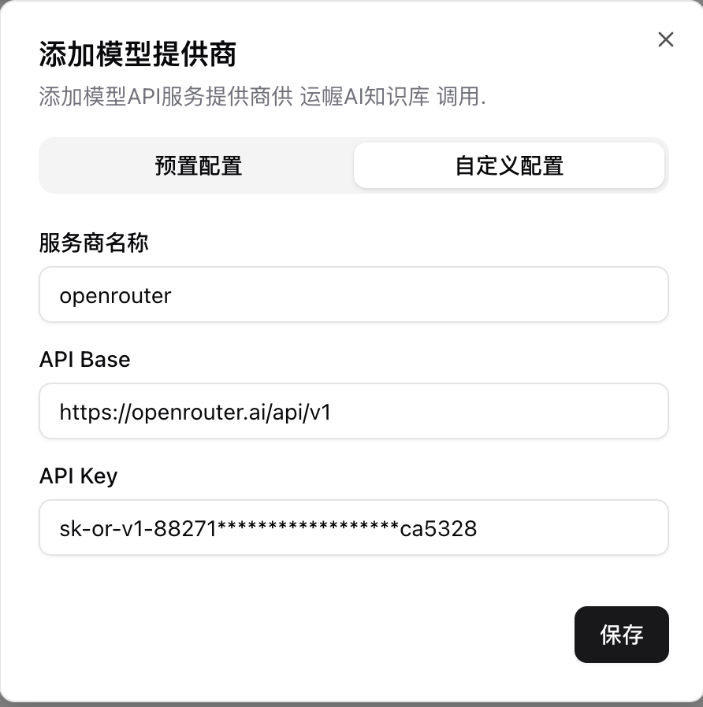
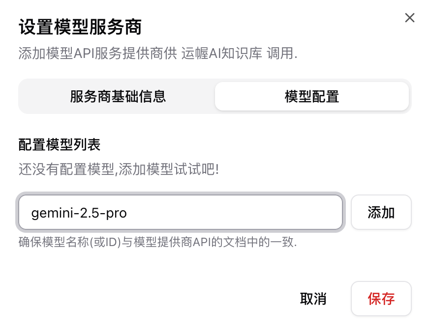
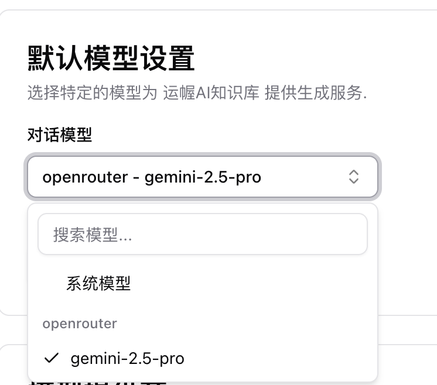

# 高级功能

## 工具箱

> 工具箱集成了自研、开源及合作伙伴提供的多种工具，仍在持续扩展中，后续会不断增加高效、智能的 AI 工具供您选择。

工具箱将成为知识库未来的核心扩展方向，我们致力于将其打造成不可或缺的生产力工具。

## 收藏夹与标签

对于常用或重要的知识库文件，可以加入收藏夹并设置颜色标签，便于快速查看与提问。

## 自定义模型设置

系统默认提供免费可用的模型。在高峰时段如需更稳定或更契合业务的回答，可添加自有模型接口。

您可以在 **设置 > 模型设置** 中管理自定义模型。

预设配置目前支持 DeepSeek、硅基流动等国内主流大模型以及 GPT 国内代理模型。提问所使用的模型将直接影响回答质量。

### 自定义模型提供商

以 OpenRouter 为例：

- API 端点（Endpoint）：`https://openrouter.ai/api/v1`
- 密钥（API Key）：`sk-or-v1-88271******************ca5328`

其他常用模型申请地址：

- `https://cdn.openai-hub.com/v1`（GPT 国内代理）
- `https://cloud.siliconflow.cn/i/YOe1599A`（硅基流动）
- `https://www.volcengine.com/`（火山引擎）
- `https://platform.deepseek.com/sign_in`（DeepSeek）

首先按照指引添加模型提供商。

随后点击提供商右侧的“编辑”，为其添加关联的模型名称，例如 `gemini-2.5-pro`。请确保模型 ID 与官方一致，否则可能无法使用。

最后，可在此处设置每次提问的默认模型。

