# 高级功能

## 工具箱

> 工具箱中提供了我们自研、开源或合作方的多种工具，可供使用。

工具箱内的ai工具是本知识库的核心功能和重点开发的方向，工具箱将成您离不开的一个宝贝神器。

目前工具箱内的布置如下：

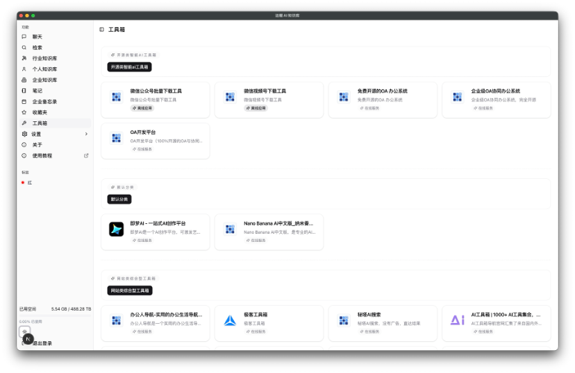

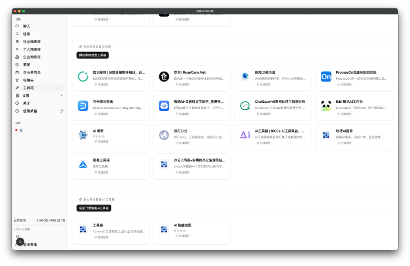

### 自主开发智能ai工具箱
目前我们完成AI智能绘图和AI工具箱两个自主开发的智能ai工具。后面马上将上线AI智能视频和AutoGen自动编制系统。自主开发智能ai工具箱和您的知识库账号相连。

首先介绍下AI智能绘图，采用谷歌的Nano Banana2作为大模型，可以一句话生成需要内容，使用简单，知识库会员每天可以免费生成10次。界面和效果如下：

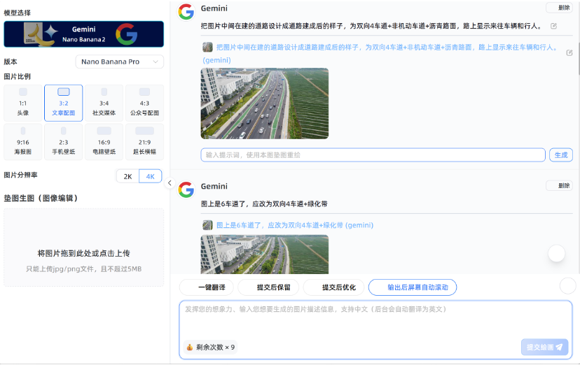

再介绍下AI工具箱，AI工具箱里有多种实用的办公工具，具体界面如下：

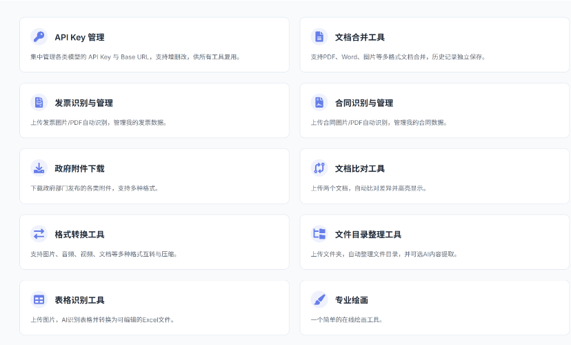

以文档合并工具为列，可以将多个PDF文档和图片文档等导入，在合并后可以以word中插入图片的方式导出，生成各类报告的附件，是各类咨询服务报告的附件编制神器。

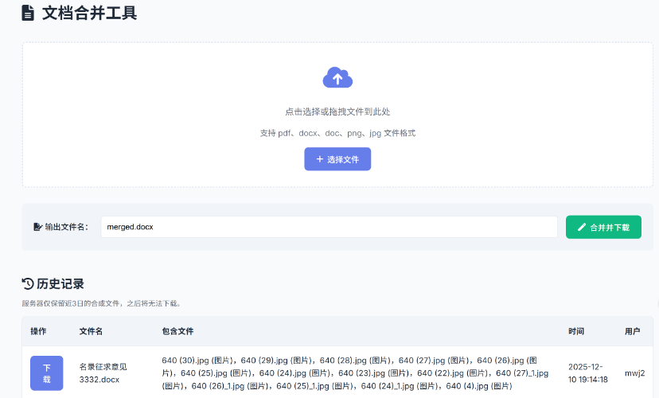

AI工具箱内的各种办公工具简单实用，各用户可自行使用

### 开源类智能 AI工具箱

工具箱内收集了一些实用的开源类智能ai工具，用户可以自行下载使用或者私有化部署。本说明书不做详细介绍。

### 网站类综合性工具箱

工具箱内收集了一些网站主流的实用ai工具网站，用户可自行付费使用。本说明书不做详细介绍。

## 收藏夹与标签

对于常用或重要的知识库文件，可以加入收藏夹并设置颜色标签，便于快速查看与提问。

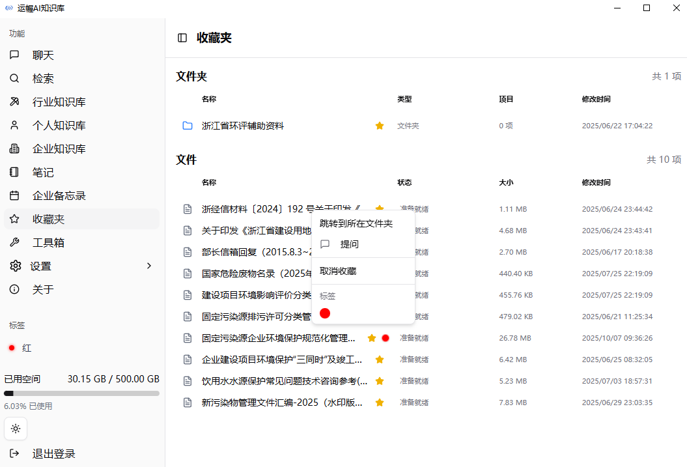

## 自定义模型设置

系统默认提供免费可用的模型。在高峰时段如需更稳定或更契合业务的回答，可添加自有模型接口。

您可以在 **设置 > 模型设置** 中管理自定义模型。

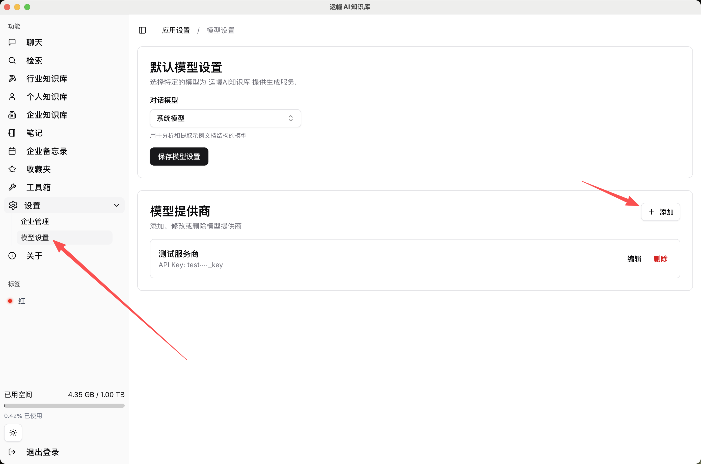

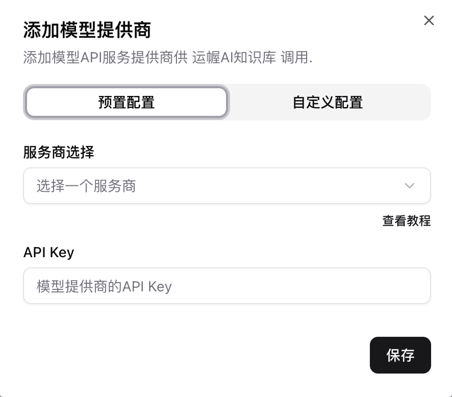
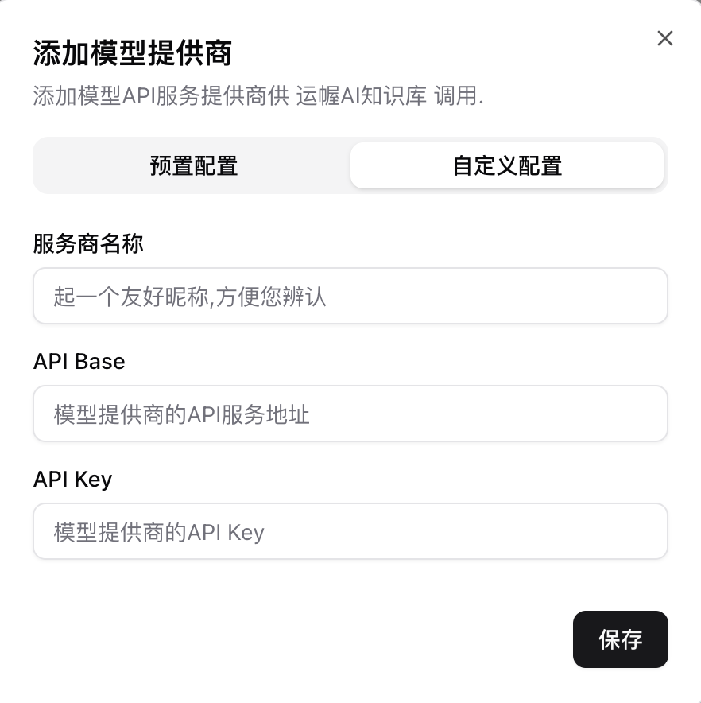

预设配置目前支持 DeepSeek、硅基流动等国内主流大模型以及 GPT 国内代理模型。提问所使用的模型将直接影响回答质量。

### 自定义模型提供商

以 OpenRouter 为例：

- API 端点（Endpoint）：`https://openrouter.ai/api/v1`
- 密钥（API Key）：`sk-or-v1-88271******************ca5328`

> 其他模型相间 [模接口型注册教程](llm-api.md)

首先按照指引添加模型提供商。

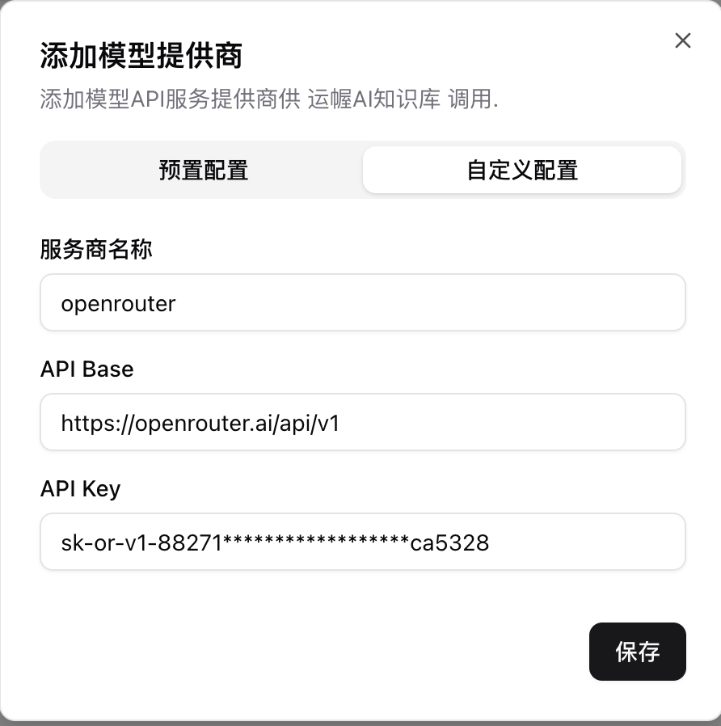

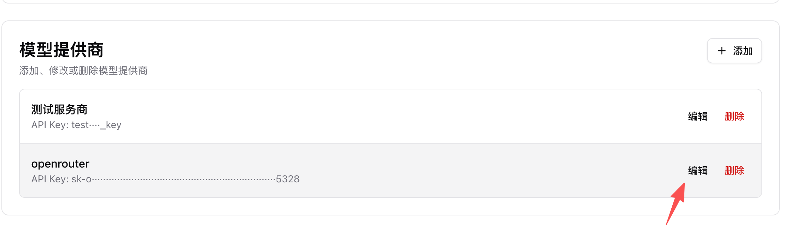

随后点击提供商右侧的“编辑”，为其添加关联的模型名称，例如 `gemini-2.5-pro`。请确保模型 ID 与官方一致，否则可能无法使用。

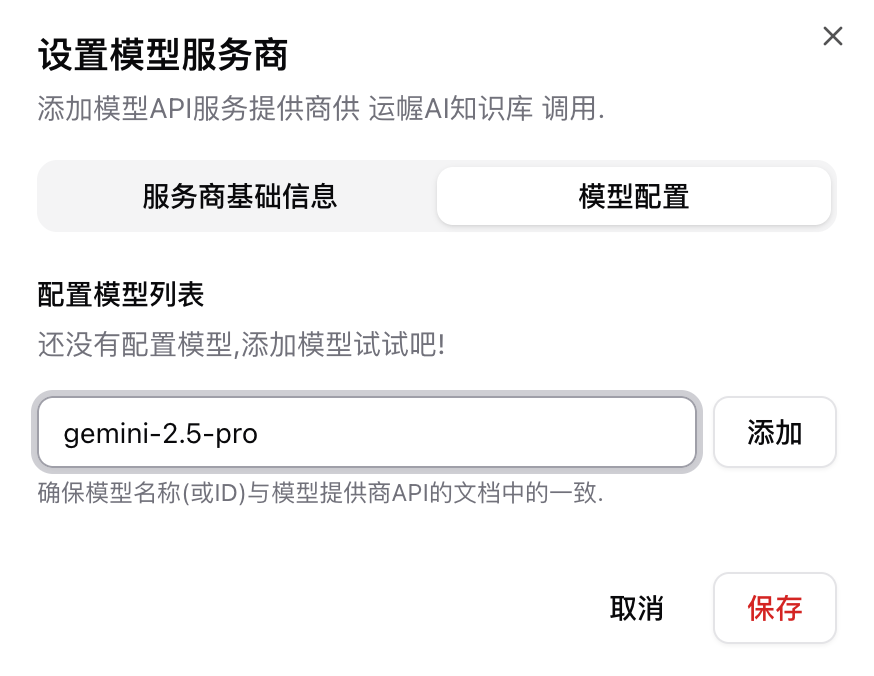

最后，可在此处设置每次提问的默认模型。

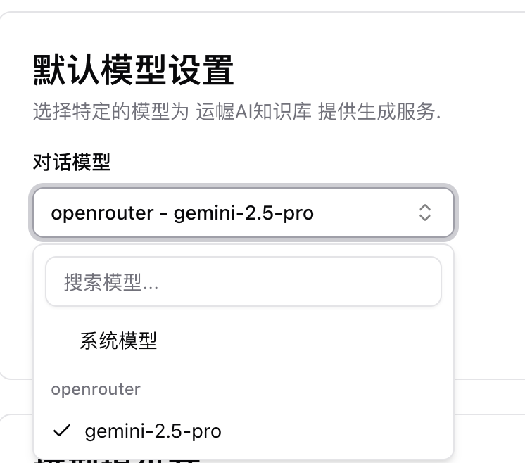
