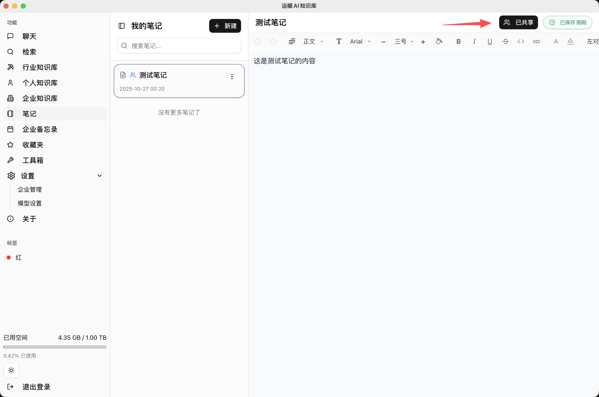

# 知识管理

## 笔记

笔记分为个人笔记与企业备忘录。

- 点击左侧“笔记”按钮，可记录工作或生活中的重要事项。
- 在右上角可以将个人笔记共享至企业备忘录中，共享后所有企业成员都能查看。
- 无论是个人笔记还是企业笔记，都可以在聊天中被检索或提问。

## 知识库文件管理

您可以管理个人知识库和企业知识库（需具备权限），支持批量选择整理好的文件夹或其中的多个文件。

**上传文件**

- 建议在高级选项中根据需要勾选全部类别，确保文件解析效果。
- 为保证上传过程不中断，应用在关闭后仍会驻留于托盘，仅在托盘中退出才会彻底结束运行。
- 支持上传的文件类型包括：TXT、PDF、DOC、DOCX、PPT、PPTX、XLS、XLSX、MD、JPG、JPEG、PNG、GIF、BMP、WEBP、MP4、MOV、AVI、WMV、FLV、MKV、DWG、DXF。
- 支持解析的文件类型包括：PDF、DOC、DOCX、PPT、PPTX、XLS、XLSX。
