# 模型接口注册教程

## 常用模型API申请地址

- `https://openrouter.ai` (OpenRouter)
- `https://api.openai-hub.com/register?aff=3vPh`（GPT 国内代理）
- `https://cloud.siliconflow.cn/i/la6mSlhF`（硅基流动）
- `https://platform.deepseek.com`（DeepSeek）

# 注册教程

## OpenRouter

> key 为     `sk-or-v1-88271******************ca5328`
> API 端点为 `https://openrouter.ai/api/v1`

1. 创建账户

    访问 [OpenRouter 注册页面](https://openrouter.ai/register) 创建账户，填写邮箱、用户名和密码，完成注册。

    

2. 进入 Key 页面
    登录后，点击右上角头像，选择 **API Keys** 进入 Key 管理页面。

    

3. 创建新的 API Key

    点击 **Create New Key** 按钮，输入 Key 名称（如 "YunwoAI"）

    
    
    然后点击 **Create**。

    

4. 查看并复制 API Key

    在 Key 管理页面，找到刚刚创建的 API Key，点击右侧的 **复制** 按钮，将其复制到剪贴板。

    

## OpenAI Hub

1. 创建账户

    访问 [OpenAI Hub 注册页面](https://api.openai-hub.com/register?aff=3vPh) 创建账户。

    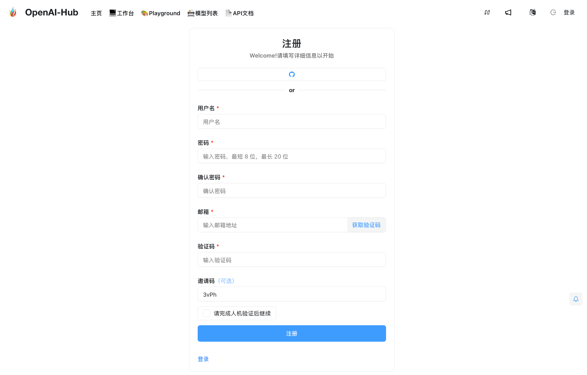

2. 进入工作台

    登录后，点击进入 Workspace/工作台。

    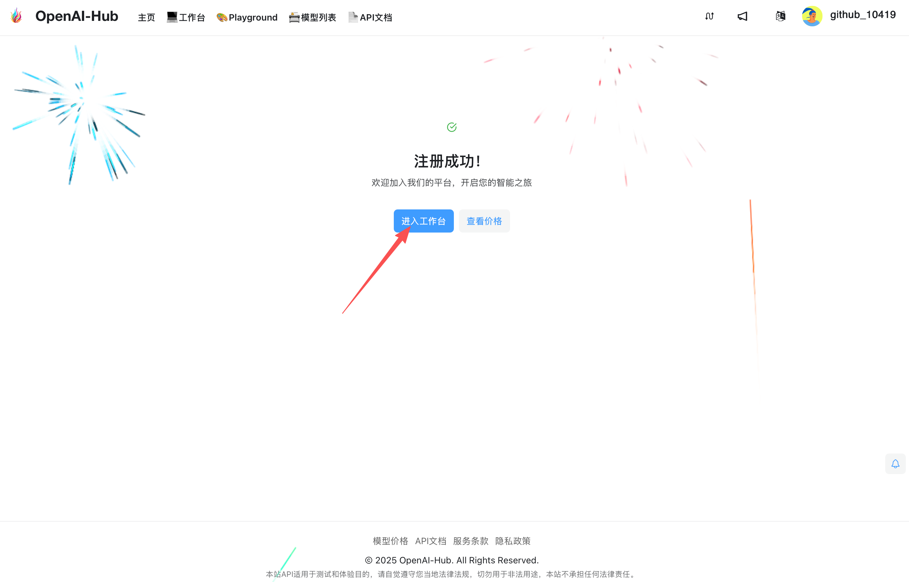

3. 打开 API 页面

    在导航中选择 **API** 选项卡。

    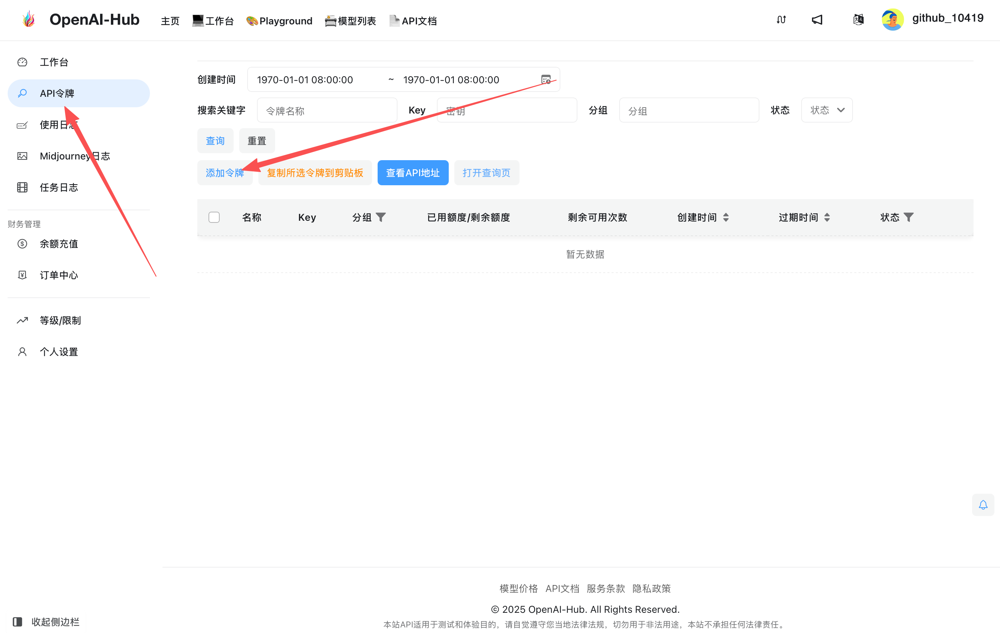

4. 选择分组并创建 Key

    在默认分组（Default Group）下，点击 **Create Key** 创建新的 API Key。

    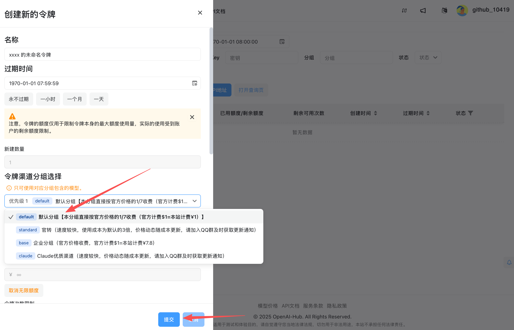

5. 复制 API Key

    在列表中找到新建的 Key，点击右侧的复制按钮保存。

    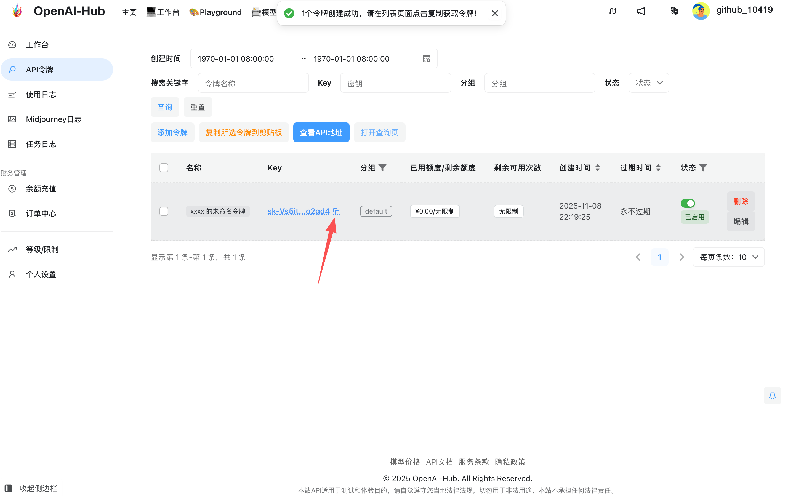

## SiliconFlow（硅基流动）

1. 创建账户

    访问 [硅基流动](https://cloud.siliconflow.cn/i/la6mSlhF) 注册并登录账号。

    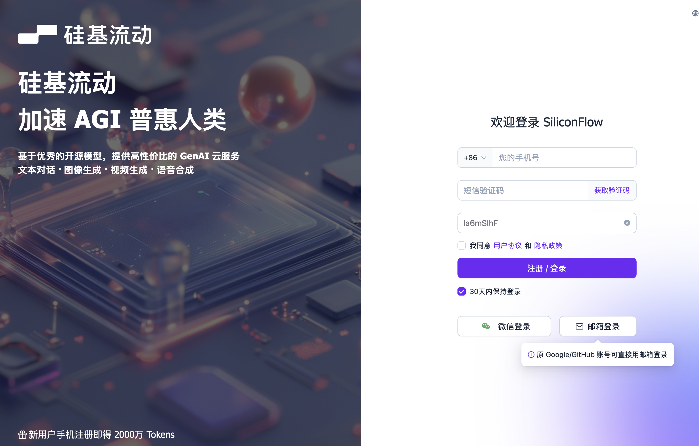

2. 打开 API 页面

    在控制台选择 **API** 标签页。

    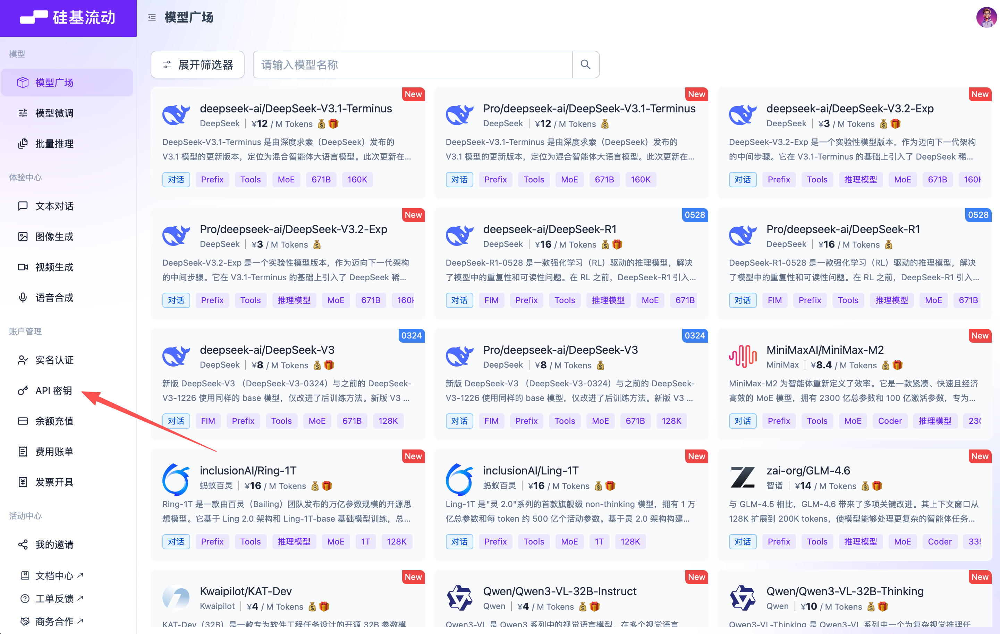

3. 创建 API Key

    点击 **Create API Key** 或 **创建 Key**，按提示确认创建。

    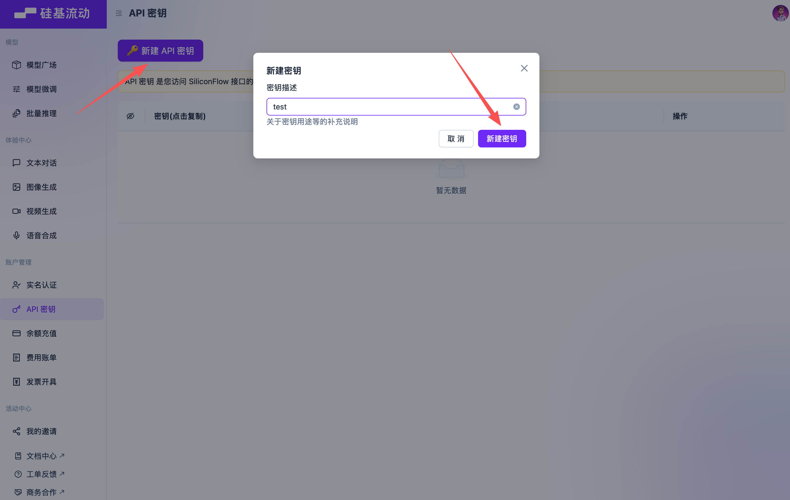

4. 复制 API Key

    在 Key 列表中复制新建的 Key，妥善保存。

    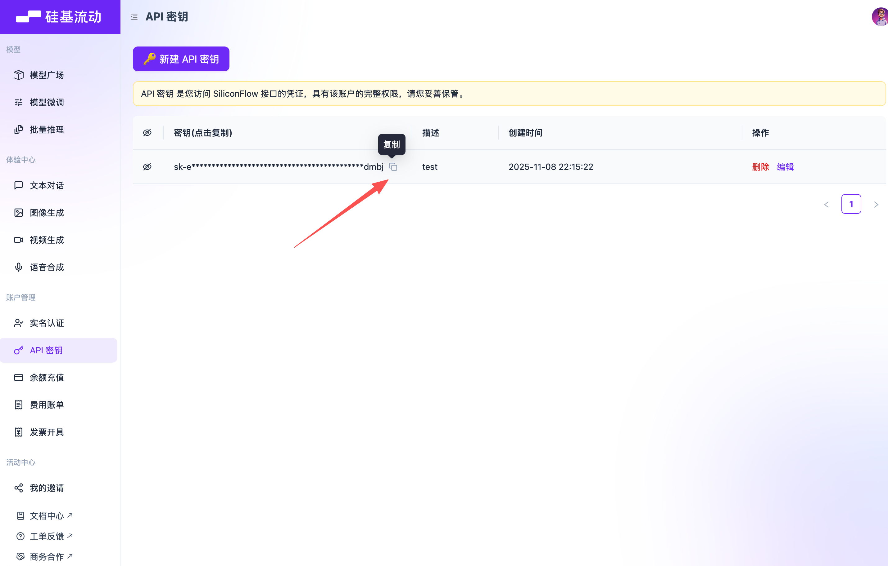

## DeepSeek

1. 创建 API Key

    登录 DeepSeek 平台后，进入 API Keys 页面，点击 **Create Key**。

    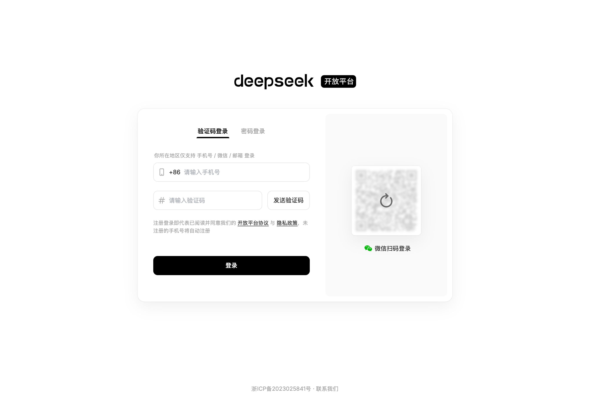

2. 打开 API Keys 标签并创建

    在 **API Keys** 标签页中，选择创建 API Key。

    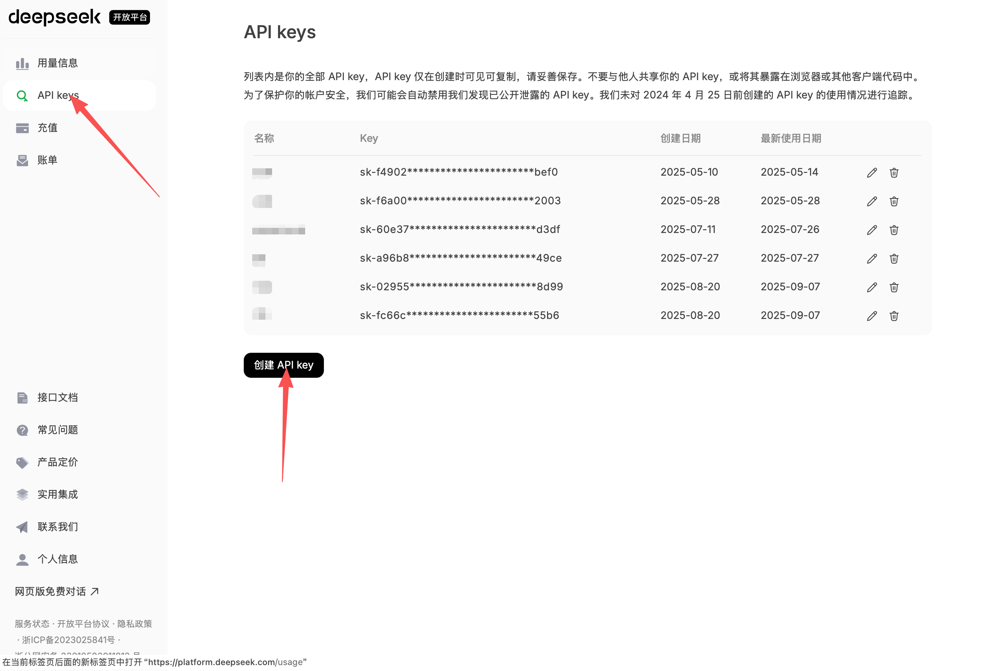

3. 复制 API Key

    创建完成后，在列表中复制你的 API Key。

    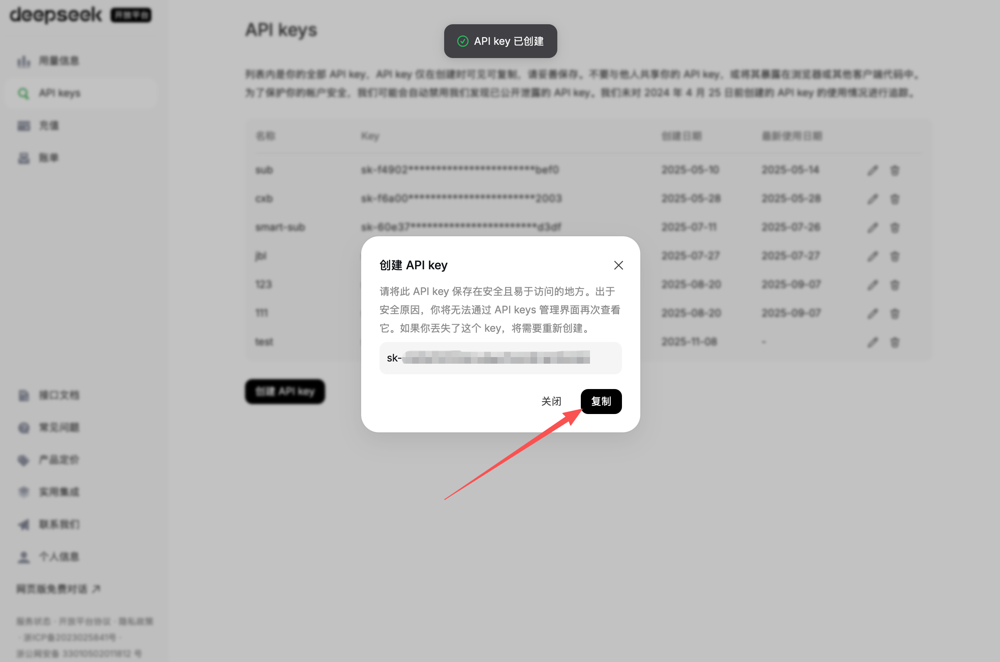