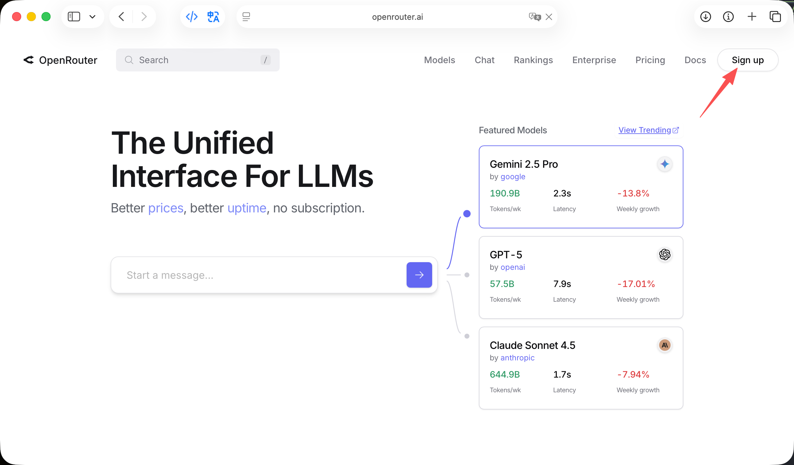
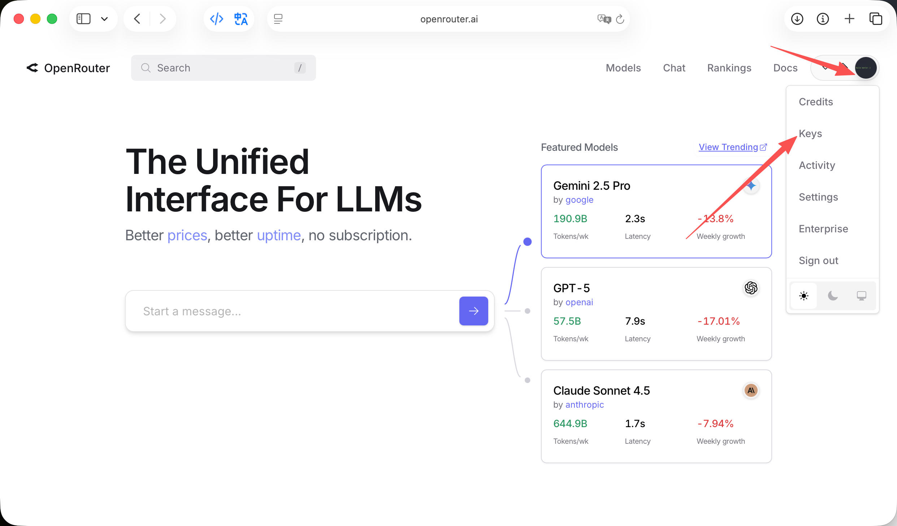
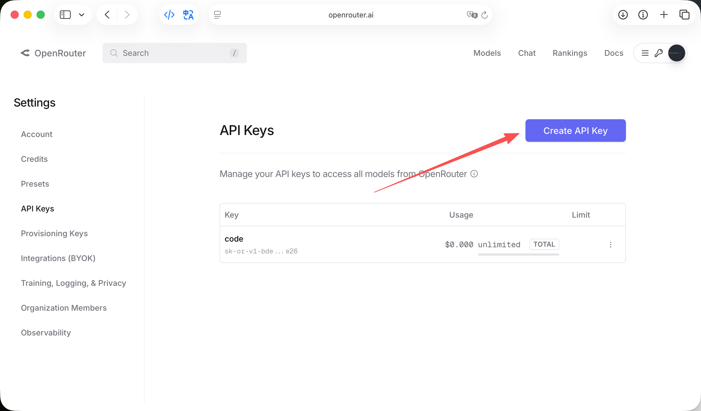
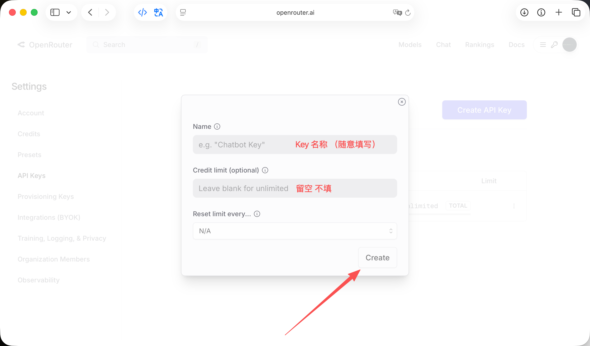
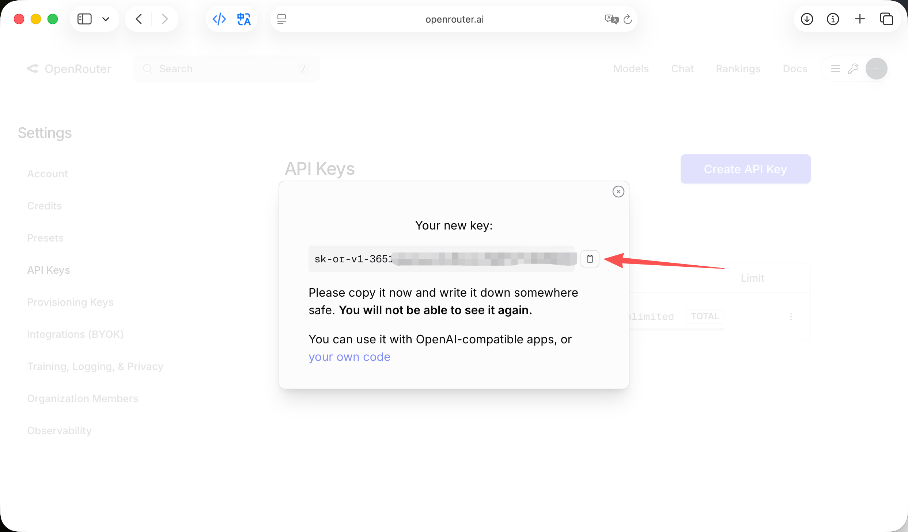

# 模型接口注册教程

## 常用模型API申请地址

- `https://openrouter.ai` (OpenRouter)
- `https://api.openai-hub.com/register?aff=3vPh`（GPT 国内代理）
- `https://cloud.siliconflow.cn/i/la6mSlhF`（硅基流动）
- `https://platform.deepseek.com`（DeepSeek）

# 注册教程

## OpenRouter

> key 为     `sk-or-v1-88271******************ca5328`
> API 端点为 `https://openrouter.ai/api/v1`

1. 创建账户

    访问 [OpenRouter 注册页面](https://openrouter.ai/register) 创建账户，填写邮箱、用户名和密码，完成注册。

    

2. 进入 Key 页面
    登录后，点击右上角头像，选择 **API Keys** 进入 Key 管理页面。

    

3. 创建新的 API Key

    点击 **Create New Key** 按钮，输入 Key 名称（如 "YunwoAI"）

    
    
    然后点击 **Create**。

    

4. 查看并复制 API Key

    在 Key 管理页面，找到刚刚创建的 API Key，点击右侧的 **复制** 按钮，将其复制到剪贴板。

    